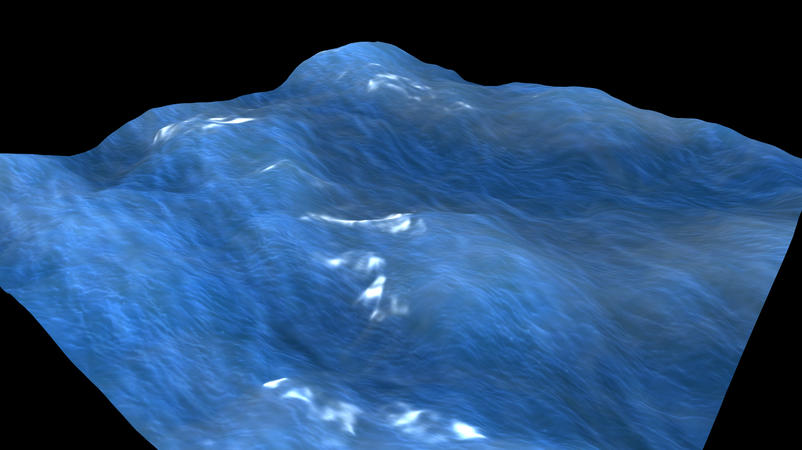

# Ocean-OpenGL
#### Simple Ocean OpenGL 4.1 C++



YouTube video: https://www.youtube.com/watch?v=H5PJNWV3I7M

### How it works?
This example do not calculate physics but do only simple interpolations between normalmaps, heightmaps. Tessellation allow us to divide plane and apply the heightmaps. Fragment allow us to calculate light so material color.
For this project I used 14 normalmaps, 14 heightmaps and one texture with color.

### Input/Control:
```
  R - start rotate camera
  T - stop rotate camera
  ESC - exit
```

### Libraries:
- GLEW library - http://glew.sourceforge.net
- GLFW library - https://www.glfw.org
- GLM library - https://glm.g-truc.net
- STB_IMAGE library - https://github.com/nothings/stb

### Requirements:
- Graphics card that support OpenGL in version 4.1
